# RetailNext Smart Stylist
## AI-Powered Fashion Assistant - Solution Brief

**Prepared for:** RetailNext Executive Team
**Version:** 2.0
**Date:** January 2026

---

## Table of Contents

1. [Executive Summary](#executive-summary)
2. [Business Challenge](#business-challenge)
3. [Solution Overview](#solution-overview)
4. [Technical Architecture](#technical-architecture)
5. [AI Capabilities](#ai-capabilities)
6. [Model Selection & Optimization](#model-selection--optimization)
7. [Business Impact & ROI](#business-impact--roi)
8. [Implementation Roadmap](#implementation-roadmap)
9. [Security & Compliance](#security--compliance)
10. [Next Steps](#next-steps)

---

## Executive Summary

The **RetailNext Smart Stylist** is an AI-powered fashion assistant that transforms how customers discover and purchase clothing. By combining natural language understanding, image analysis, voice interaction, and intelligent inventory search, the solution delivers personalized outfit recommendations that increase sales and reduce customer frustration.

### Key Outcomes

| Metric | Projected Impact |
|--------|------------------|
| Average Basket Size | **+25%** increase |
| Customer Walk-out Rate | **-30%** reduction |
| Cost per Interaction | **$0.018** |
| Return on Investment | **281:1** |

### Technology Foundation

The solution integrates **six OpenAI APIs** optimized for cost and performance:

```
┌─────────────────────────────────────────────────────────────────┐
│  SMART STYLIST AI STACK                                         │
├─────────────────────────────────────────────────────────────────┤
│  Chat & Reasoning     │  GPT-4.1-mini         │  $0.40/1M tokens │
│  Image Analysis       │  GPT-4.1-mini Vision  │  Included        │
│  Voice Input          │  gpt-4o-mini-transcribe│ $0.003/minute   │
│  Voice Output         │  gpt-4o-mini-tts      │  $0.015/minute   │
│  Semantic Search      │  text-embedding-3-large│ $0.13/1M tokens │
│  Data Extraction      │  Structured Outputs   │  Included        │
└─────────────────────────────────────────────────────────────────┘
```

---

## Business Challenge

### The Problem

RetailNext customers face a common frustration: finding the right outfit for specific events. Whether it's a graduation, wedding, job interview, or casual weekend, customers struggle to:

- Navigate large inventories without guidance
- Articulate their needs to busy staff
- Find complete, coordinated outfits
- Get personalized recommendations quickly

### The Impact

| Challenge | Business Cost |
|-----------|---------------|
| Customer walks out without purchase | Lost sale (~$120 average) |
| Staff time per assisted customer | 15-20 minutes |
| Peak hour staffing limitations | Reduced service quality |
| Inconsistent styling advice | Lower customer satisfaction |

### The Opportunity

An AI assistant that understands customer intent, searches inventory intelligently, and provides complete outfit solutions—available 24/7, scaling effortlessly from one customer to thousands.

---

## Solution Overview

### How It Works

```mermaid
flowchart LR
    subgraph Customer["Customer Interaction"]
        TEXT[💬 Text Chat]
        VOICE[🎤 Voice Input]
        IMAGE[📷 Image Upload]
    end

    subgraph AI["Smart Stylist AI"]
        UNDERSTAND[Understand Intent]
        SEARCH[Search Inventory]
        RECOMMEND[Build Recommendations]
    end

    subgraph Output["Personalized Results"]
        OUTFIT[Complete Outfit]
        LOCATION[Store Locations]
        AUDIO[Voice Response]
    end

    TEXT --> UNDERSTAND
    VOICE --> UNDERSTAND
    IMAGE --> UNDERSTAND
    UNDERSTAND --> SEARCH
    SEARCH --> RECOMMEND
    RECOMMEND --> OUTFIT
    RECOMMEND --> LOCATION
    RECOMMEND --> AUDIO
```



### Key Capabilities

#### 1. Natural Language Understanding
Customer says: *"I need something for my daughter's graduation next Saturday—it's outdoors"*

The AI understands:
- **Event:** Graduation (semi-formal)
- **Timing:** Next Saturday (seasonal considerations)
- **Venue:** Outdoor (fabric and style implications)
- **Relationship:** Shopping for daughter (likely women's styles)

#### 2. Visual Style Matching
Customer uploads a photo of an existing item and asks: *"What would go with this?"*

The AI analyzes:
- Colors and patterns
- Style category (formal, casual, bohemian)
- Occasion suitability
- Complementary items in inventory

#### 3. Complete Outfit Assembly
Instead of single-item suggestions, the AI provides:
- Head-to-toe coordinated outfit
- Multiple alternatives at different price points
- Exact store locations (Aisle B1, Bin C2)
- Real-time availability

#### 4. Brand Voice
Australian-accented voice responses customized to RetailNext's brand personality—warm, helpful, and knowledgeable.

---

## Technical Architecture

### System Architecture


### Request Flow


---

## AI Capabilities

### Capability 1: Intelligent Conversation

**Technology:** GPT-4.1-mini with Function Calling

The AI engages in natural conversation, understanding context and intent without requiring structured inputs or menu selections.

| Input Type | Example | AI Understanding |
|------------|---------|------------------|
| Event-based | "Wedding guest outfit" | Formal, celebratory, coordinated |
| Style-based | "Something casual for the weekend" | Relaxed, comfortable, versatile |
| Constraint-based | "Under $200 for a job interview" | Professional, budget-conscious |
| Relationship-based | "Gift for my wife's birthday" | Women's, special occasion |

### Capability 2: Image Analysis

**Technology:** GPT-4.1-mini Vision

Customers can upload photos of existing clothing items to find complementary pieces.


### Capability 3: Voice Interaction

**Technology:** gpt-4o-mini-transcribe + gpt-4o-mini-tts

Full voice support with Australian accent customization:

| Component | Model | Capability |
|-----------|-------|------------|
| Speech Recognition | gpt-4o-mini-transcribe | Accurate transcription, accent-aware |
| Voice Synthesis | gpt-4o-mini-tts | Natural speech, instruction-steered accent |

**Voice Customization Example:**
```
Instruction: "Speak with a warm, friendly Australian accent.
Sound like a helpful retail assistant in Melbourne."
```

### Capability 4: Semantic Search (RAG)

**Technology:** text-embedding-3-large with 256-dimensional vectors

Unlike keyword search, semantic search understands meaning:

| Customer Query | Keyword Match | Semantic Match |
|----------------|---------------|----------------|
| "Something for a garden party" | ❌ No results | ✅ Floral dresses, linen suits |
| "Professional but not boring" | ❌ No results | ✅ Modern blazers, statement accessories |
| "Beachy vibes" | ❌ No results | ✅ Linen shirts, resort wear |

### Capability 5: Structured Data Extraction

**Technology:** JSON Schema with Strict Mode

Every customer query is parsed into structured data for reliable downstream processing:

```json
{
  "event_type": "graduation",
  "formality_level": "semi-formal",
  "season": "spring",
  "venue_type": "outdoor",
  "gender": "female",
  "budget_range": "medium",
  "color_preferences": ["elegant", "not too dark"],
  "specific_requirements": ["comfortable for standing"]
}
```

### Capability 6: Dynamic Inventory Operations

**Technology:** Function Calling

The AI can perform real-time inventory operations:

| Function | Purpose | Example |
|----------|---------|---------|
| `check_inventory` | Verify availability | "Is this in size 10?" |
| `find_similar_items` | Semantic alternatives | "Show me similar but cheaper" |
| `get_outfit_bundle` | Complete looks | "Build me a full outfit" |
| `get_item_location` | Store directions | "Where can I find this?" |

---

## Model Selection & Optimization

### Why These Models?

We evaluated the complete OpenAI model portfolio against five requirements:


### Model Comparison Matrix

| Model | Input Cost | Output Cost | Context | Vision | Latency | Decision |
|-------|------------|-------------|---------|--------|---------|----------|
| GPT-4o | $2.50/1M | $10.00/1M | 128K | ✅ | ~800ms | Too expensive |
| GPT-4.1 | $2.00/1M | $8.00/1M | 1M | ✅ | ~500ms | Overkill |
| **GPT-4.1-mini** | **$0.40/1M** | **$1.60/1M** | **1M** | ✅ | **~300ms** | **Selected** |
| GPT-4.1-nano | $0.10/1M | $0.40/1M | 1M | ❌ | ~200ms | No vision |

### Cost Optimization Results

By selecting GPT-4.1-mini over GPT-4o:

| Metric | GPT-4o | GPT-4.1-mini | Improvement |
|--------|--------|--------------|-------------|
| Input Cost | $2.50/1M | $0.40/1M | **84% savings** |
| Output Cost | $10.00/1M | $1.60/1M | **84% savings** |
| Latency | ~800ms | ~300ms | **62% faster** |
| Context Window | 128K | 1M | **8x larger** |

### Audio Model Selection

| Purpose | Model | Cost | Rationale |
|---------|-------|------|-----------|
| Speech-to-Text | gpt-4o-mini-transcribe | $0.003/min | 50% cheaper, fast, accurate |
| Text-to-Speech | gpt-4o-mini-tts | $0.015/min | Instruction-steered accents |

---

## Business Impact & ROI

### Investment Analysis


#### Cost Breakdown (10,000 conversations/day)

| Component | Unit Cost | Daily Volume | Monthly Cost |
|-----------|-----------|--------------|--------------|
| Chat (GPT-4.1-mini) | $0.002 | 10,000 | $600 |
| Embeddings | $0.0003 | 10,000 | $90 |
| Transcription | $0.0015 | 5,000 | $225 |
| TTS | $0.015 | 5,000 | $2,250 |
| **API Subtotal** | | | **$3,165** |
| Infrastructure | | | $2,000 |
| Buffer (70%) | | | $2,215 |
| **Total** | | | **~$8,000** |

### Return Analysis


### ROI Summary

```
┌─────────────────────────────────────────────────────────────────┐
│  RETURN ON INVESTMENT                                           │
├─────────────────────────────────────────────────────────────────┤
│                                                                 │
│  Monthly Investment:     $8,000                                 │
│  Monthly Return:         $2,250,000                             │
│                                                                 │
│  ═══════════════════════════════════════════════════════════   │
│                                                                 │
│  ROI:                    281:1                                  │
│                                                                 │
│  ═══════════════════════════════════════════════════════════   │
│                                                                 │
│  Conservative (10% of projection):                              │
│  Monthly Return:         $225,000                               │
│  ROI:                    28:1                                   │
│                                                                 │
└─────────────────────────────────────────────────────────────────┘
```

### Value Beyond Revenue

| Benefit | Impact |
|---------|--------|
| Staff Efficiency | +40% customers served per staff hour |
| Customer Satisfaction | Projected +15 NPS points |
| Data Intelligence | Customer preference insights from every conversation |
| Competitive Advantage | Capability competitors lack |
| 24/7 Availability | No staffing limitations |

---

## Implementation Roadmap


### Phase Details

#### Phase 1: Technical Pilot (Weeks 1-4)
- Deploy to 3 high-traffic stores
- Staff-assisted introduction to customers
- Daily monitoring and optimization
- **Goal:** Validate technical stability

#### Phase 2: Controlled Expansion (Weeks 5-12)
- Expand to 10-15 stores
- Integrate with live inventory system
- A/B test against control stores
- **Goal:** Validate business impact

#### Phase 3: Broad Rollout (Months 4-6)
- Deploy to all stores
- Self-service kiosks
- Mobile app integration
- Full POS connection
- **Goal:** Scale and optimize

#### Phase 4: Enhancement (Ongoing)
- Customer profile personalization
- Multi-language support
- Virtual try-on integration
- Predictive inventory insights

---

## Security & Compliance

### Data Protection

| Aspect | Implementation |
|--------|----------------|
| API Keys | Server-side only, environment variables |
| Customer Data | Stateless by default, no persistent storage |
| Images | Processed in-memory, discarded after response |
| Conversations | Not logged or stored |
| PII | Not collected or transmitted |

### Compliance Options

#### Standard Deployment (OpenAI Direct)
- Data processed in US
- SOC 2 compliant
- API data not used for training

#### Australian Data Residency (Azure OpenAI)
- Data processed in **Australia East (Sydney)** or **Australia Southeast (Melbourne)**
- All data remains onshore
- IRAP assessed
- ISO 27001, SOC 2 compliant


### Enterprise Security Features

- Input validation and sanitization
- Rate limiting per session
- HTTPS encryption (TLS 1.3)
- Health monitoring and alerting
- Graceful degradation on failures

---

## Next Steps

### Immediate Actions

1. **Technical Requirements**
   - Provide inventory API documentation
   - Define integration endpoints
   - Establish test environment access

2. **Pilot Planning**
   - Select 3 pilot store locations
   - Identify staff champions
   - Define success metrics

3. **Project Kickoff**
   - Assign project sponsor
   - Establish communication cadence
   - Set milestone dates

### Success Criteria for Pilot

| Metric | Target |
|--------|--------|
| System Uptime | >99.5% |
| Conversation Completion | >80% |
| Recommendation Acceptance | >30% |
| Customer Satisfaction | >4.2/5 |

---

## Contact

**Solution Architect:** [Your Name]
**Email:** [your.email@company.com]
**Next Meeting:** [Proposed Date]

---

*This document is confidential and intended for RetailNext executive review.*
