# Technical Talk Track: RetailNext Smart Stylist

A comprehensive technical walkthrough for presenting this solution to technical audiences.

---

## Solution Overview

RetailNext Smart Stylist is a multimodal AI fashion assistant demonstrating integration of six OpenAI APIs into a cohesive retail customer experience.

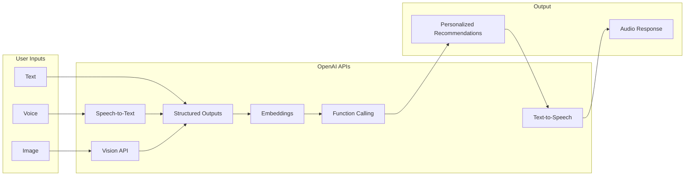

---

## Three-Tier Architecture

The solution follows a clean separation of concerns across three layers.

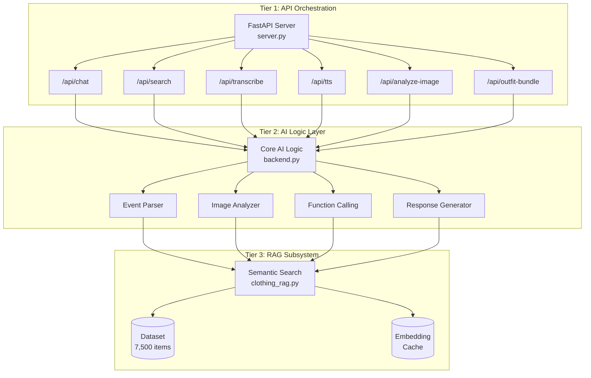

### Layer Responsibilities

| Layer | Component | Responsibility |
|-------|-----------|----------------|
| **Tier 1** | server.py | Request routing, validation, CORS, response formatting |
| **Tier 2** | backend.py | OpenAI API integrations, function dispatch, demo fallbacks |
| **Tier 3** | clothing_rag.py | Embedding generation, similarity search, data enrichment |

---

## API Integration Chain

Six OpenAI APIs working in sequence to process multimodal input.

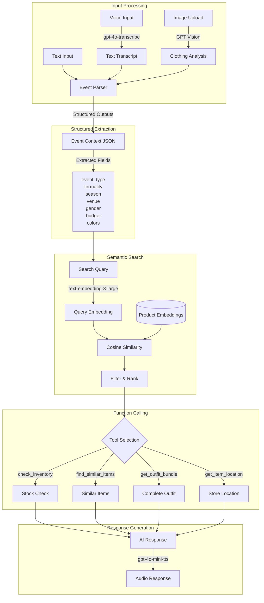

---

## Multimodal Input Pipeline

Each input type follows a specialized processing path before converging.

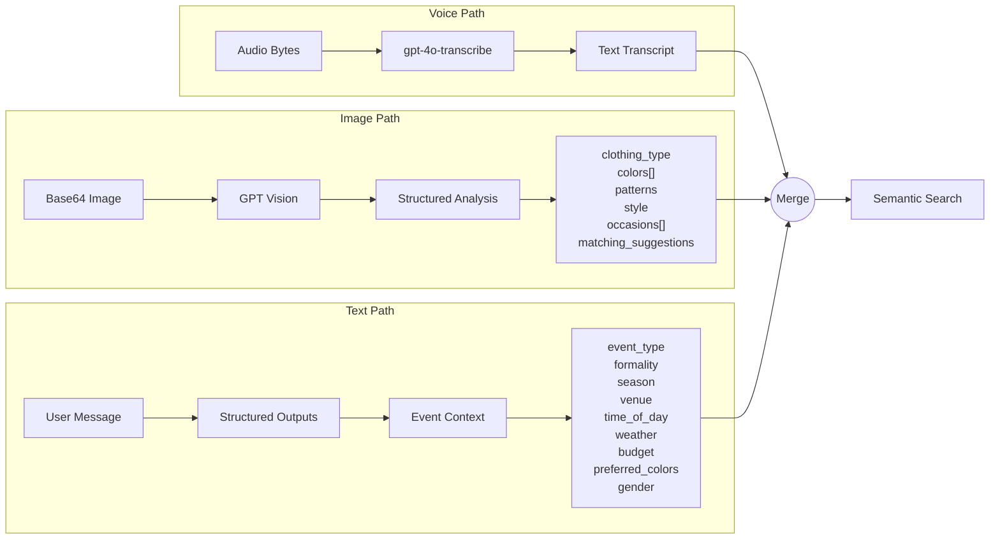

---

## RAG System Architecture

The Retrieval Augmented Generation system for semantic product discovery.

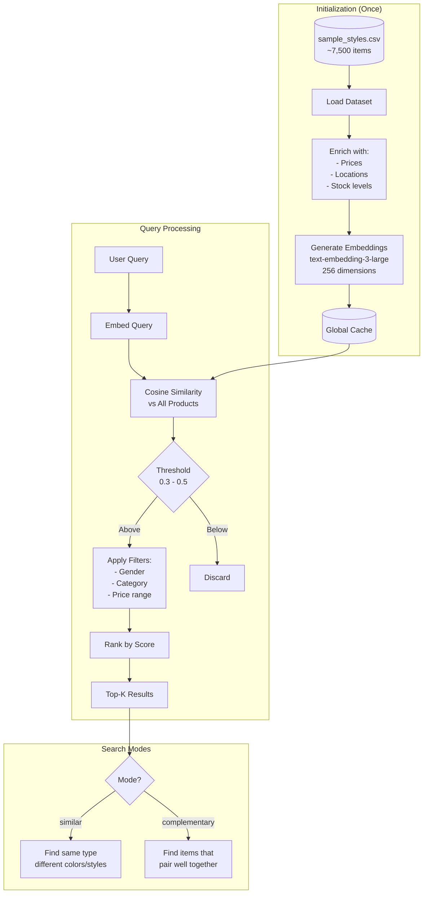

### Embedding Strategy

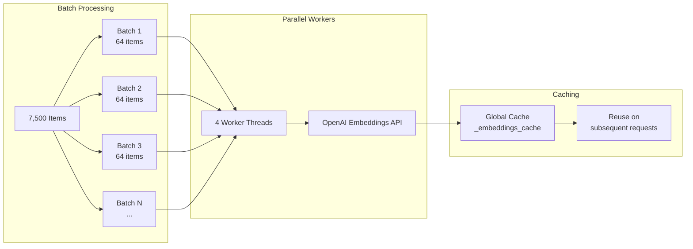

---

## Function Calling Pattern

Dynamic tool invocation based on conversation context.

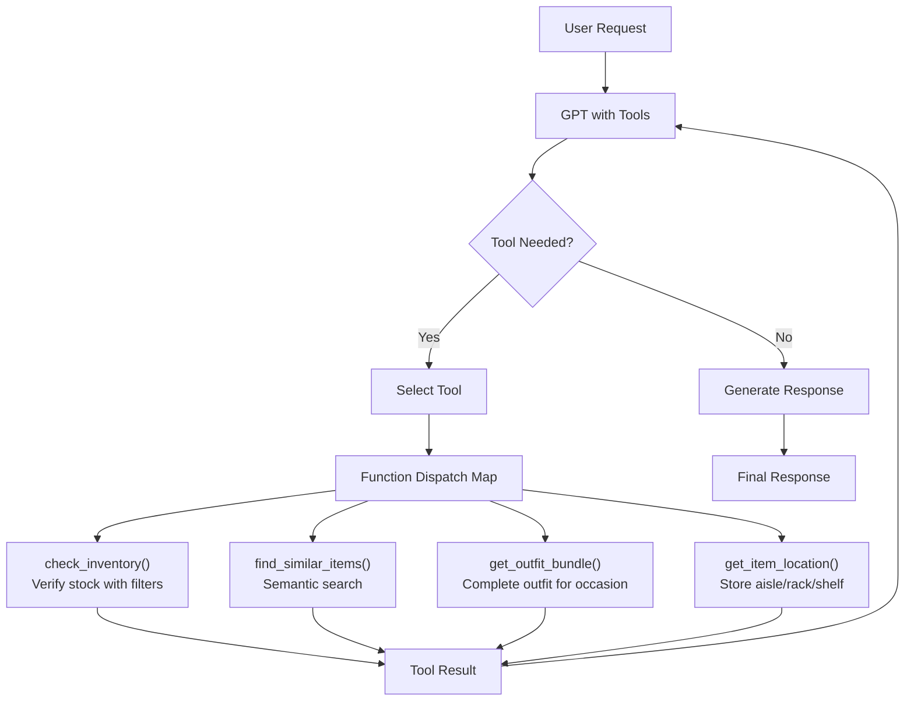

### Tool Definitions

| Tool | Purpose | Example Trigger |
|------|---------|-----------------|
| `check_inventory` | Verify stock with color/size filters | "Do you have this in blue?" |
| `find_similar_items` | Semantic search with constraints | "Something like this but cheaper" |
| `get_outfit_bundle` | Generate complete outfit | "I need a full outfit for a wedding" |
| `get_item_location` | Return store location | "Where can I find this?" |

---

## Data Flow: End-to-End Request

Complete flow from user input to response.

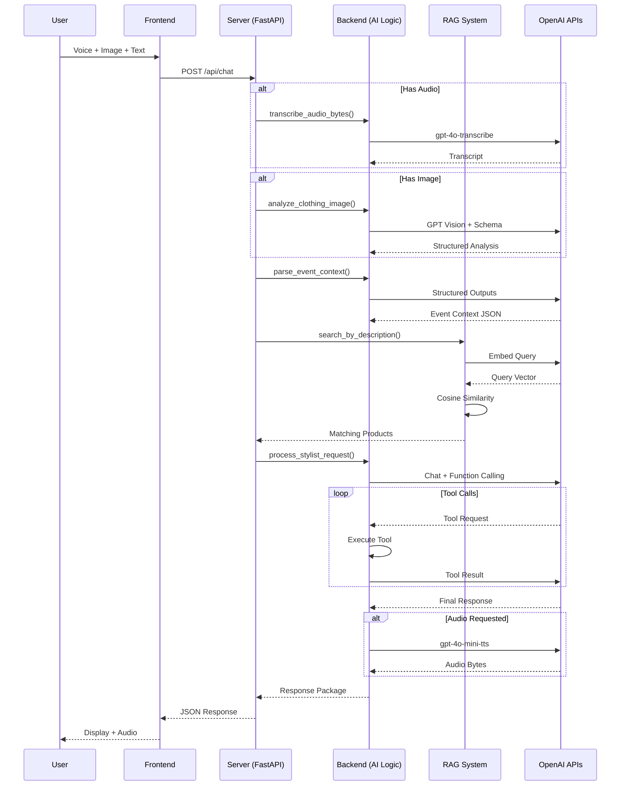

---

## Response Structure

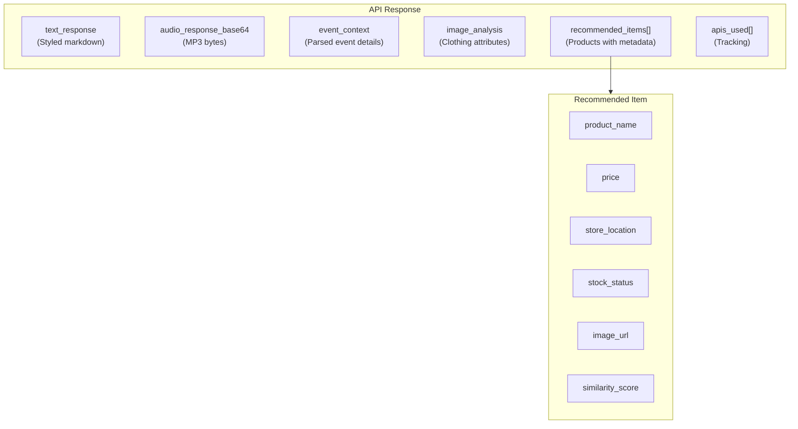

---

## Design Patterns

### Demo Mode Fallback Architecture

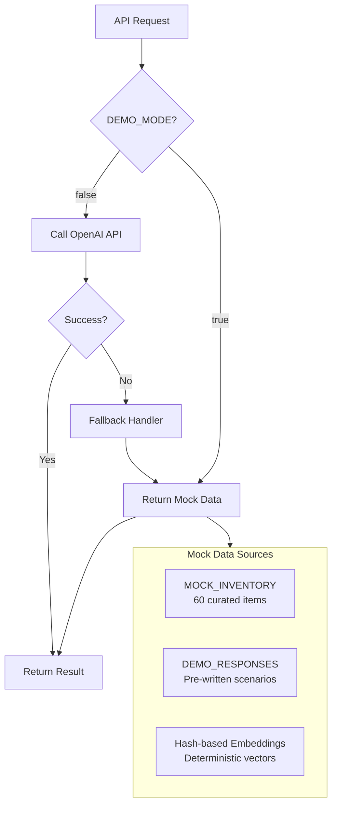

### Caching Strategy

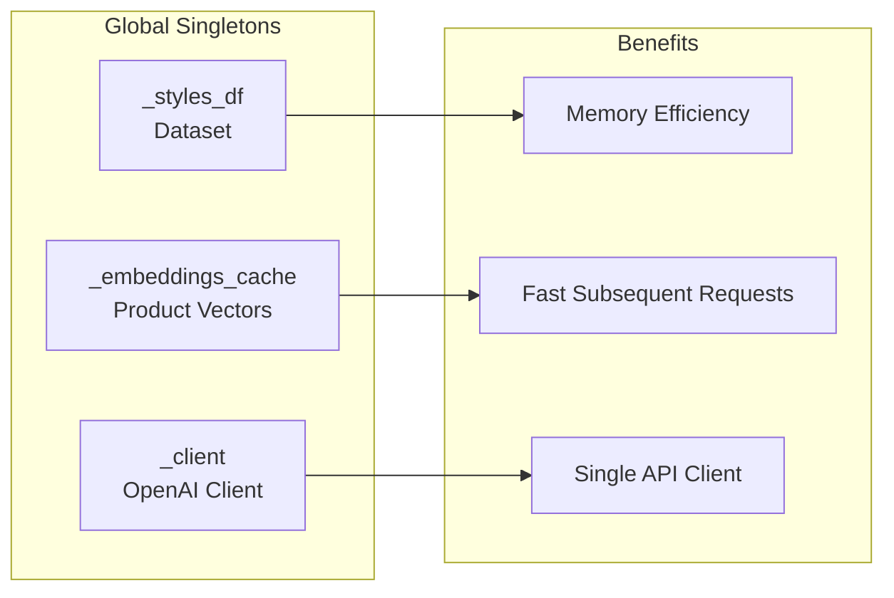

---

## OpenAI API Summary

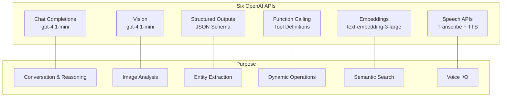

---

## Scaling Considerations

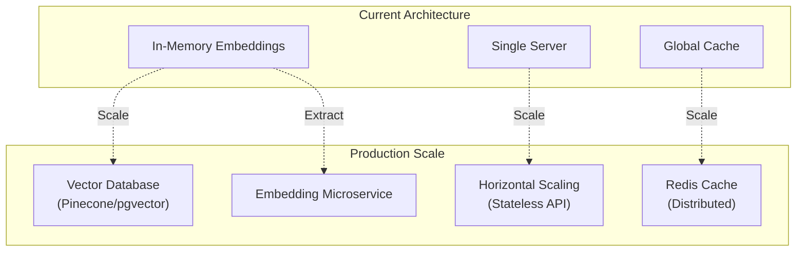

---

## Key Talking Points

1. **Multimodal Input Pipeline** - Voice, image, and text converge through specialized processing paths
2. **Structured Outputs** - JSON schema guarantees parsing reliability vs. prompt-based extraction
3. **Semantic Search** - Embeddings understand meaning, not just keywords
4. **Complementary Search** - Find items that pair together, not just similar items
5. **Function Calling** - Dynamic tool invocation based on conversation context
6. **Demo Mode** - First-class fallback system for reliable demonstrations
7. **Lazy Initialization** - Fast startup, defer expensive operations
8. **Deterministic Enrichment** - Consistent mock data across requests

---

## Anticipated Questions

| Question | Key Points |
|----------|------------|
| "How would this scale?" | Vector DB for embeddings, stateless API layer, extract embedding service |
| "Why structured outputs?" | Schema compliance guaranteed, eliminates parsing failures |
| "Why 256 dimensions?" | Tradeoff between semantic resolution and computation speed |
| "How handle API failures?" | Try/catch with fallbacks, demo mode, consistent response structure |
| "Why Python?" | First-class OpenAI SDK support, FastAPI async, rapid prototyping |
